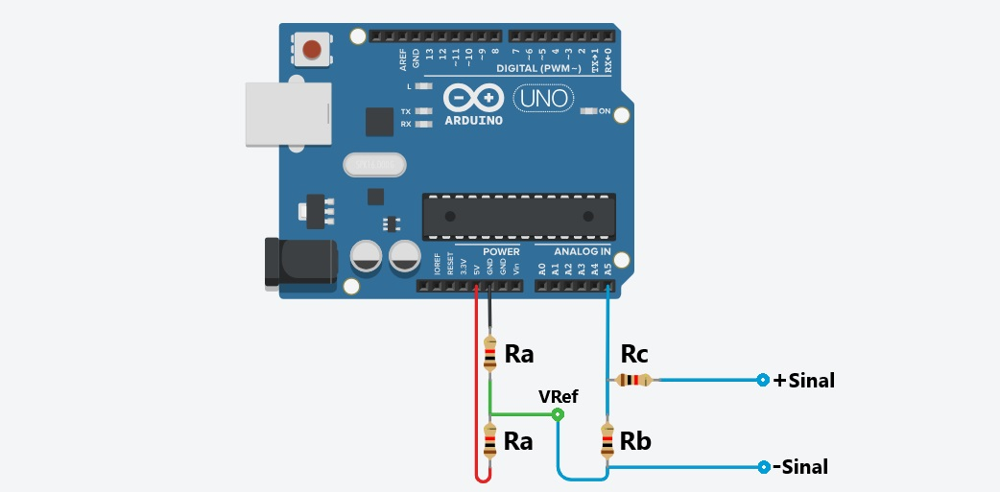

# Osciloscópio Serial

*Osciloscópio Serial* é um software desenvolvido em Python para funcionar em conjunto com o Arduino. Ele permite a leitura de múltiplos sinais analógicos e a análise em tempo real das suas características, como frequência, tensão eficaz e tensão pico a pico. O software também ajusta automaticamente as escalas de tempo e amplitude dos gráficos, facilitando a visualização dos sinais.


## Funcionalidades

- *Leitura simultânea de vários sinais*: o Arduino envia os valores lidos dos pinos analógicos via comunicação serial. Cada valor de sinal é separado por espaços na mensagem (exemplo: 0.5 0.1 0.7).
- *Análise automática dos sinais*: o programa calcula automaticamente a frequência, Vrms (tensão eficaz) e Vpp (tensão de pico a pico) para cada sinal recebido.
- *Ajuste automático de escalas*: as escalas de tempo e amplitude dos sinais exibidos no gráfico são ajustadas automaticamente.
- *Detecção automática da placa*: o programa detecta automaticamente todas as placa Arduino conectadas às portas USB do computador para que o usuário selecione qual deseja usar.
- *Suporte para leitura com divisor de tensão*: como o Arduíno lê apenas sinais entre 0.0 e 5.0 volts é possível realizar um divisor de tensão com resistores para reconhecer valores de tensão fora dessa escala.

## Requisitos

O projeto depende de algumas bibliotecas Python que estão listadas no arquivo requirements.txt. Certifique-se de instalar todas as dependências antes de executar o programa.

### Instalação das dependências

Para instalar as dependências, execute o seguinte comando:

```bash
pip install -r requirements.txt
```

## Como usar

1. Certifique-se de que o Arduino esteja configurado para enviar os valores dos pinos analógicos via comunicação serial.

2. Conecte a placa Arduino a uma porta USB do computador.

3. Execute o programa Python.

4. Atualize a frequência de amostragem configurada na leitura do Arduino no menu "Config > Frequência de amostragem".

5. Configure a quantidade de sinais lido pelo Arduino no menu "Config > Entrada de sinais". É importante informar na configuração a quantidade exata de sinais lidos senão o programa não funcionará corretamente.

6. Caso esteja utilizando divisor de tensão para ler valores negativos e maiores que 5V, configure os valores de Rb e Rc no menu "Config > Divisor de tensão".

7. No menu "Portas > Selecionar dispositivo de entrada" e selecione a placa que fará a leitura dos sinais. Em seguida, o programa começará a exibir as leituras na tela.

## Divisor de tensão

A ligação com o divisor de tensão é feita com o auxílio de uma tensão de referência gerada entre os pinos 5V e GND por dois resistores de mesmo valor Ra. A leitura é feita entre um resistor Rc ligado ao sinal lido e o pino de leitura e um resistor Rb ligado entre o pino de leitura e as tensões de referência do Arduino e do sinal lido.

Caso prefira não utilizar o divisor de tensão, basta ligar o sinal lido diretamente ao pino e a sua referência ao pino GND. Lembre-se de ativar (ou desativar) esse recurso e configurar os valores de Rb e Rc no menu "Config > Divisor de tensão".

Na figura a seguir é mostrada como é feita essa ligação para uma leitura feita no pino A5.



## Código Arduino

Há um exemplo de código para realizar a leitura de 3 sinais simultâneos utilizando diferentes pinos do Arduino como entrada. [app/arduino/example.ino](app/arduino/example.ino)

### Exemplo de mensagem recebida

A cada amostra de sinal coletada, o Arduino deverá enviar os valores separados por espaço em uma mensagem via serial, por exemplo:

```bash
0.5 0.1 0.7
```

O software irá processar os sinais formados pelos valores enviados pelas sucessivas mensagens, calculando suas respectivas frequências, Vrms e Vpp.

## Licença

Este projeto está licenciado sob a [MIT License](LICENSE).
